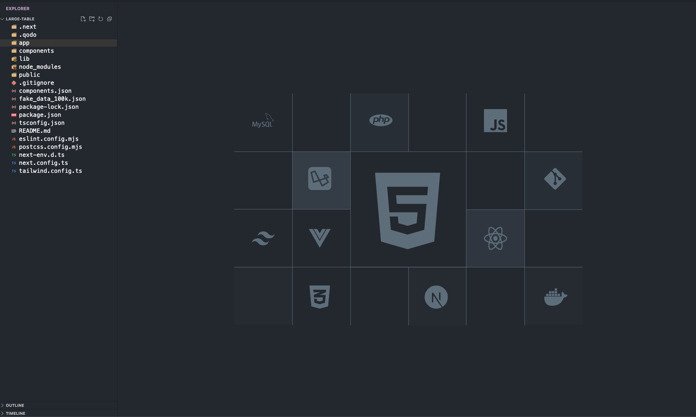
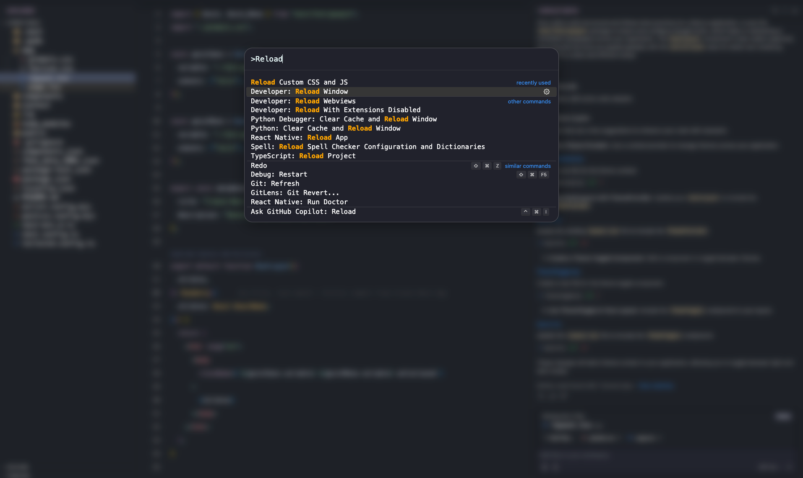

# Minimal VSCode Setup

### A minimalist configuration for Visual Studio Code that enhances the editor's appearance and functionality through custom settings, CSS, and JavaScript modifications.

## Overview





This repository contains configuration files to create a clean, distraction-free VSCode environment with custom theming.

## Contents

- `settings.json` - Core VSCode user settings
- `custom.css` - Custom styling rules
- `custom.js` - JavaScript modifications
- Other configuration files

## Shoutout

Special thanks to [Glenn Raya](https://github.com/glennraya) for the inspiration and guidance in creating this setup.
Check out his [youtube video](https://www.youtube.com/watch?v=9_I0bySQoCs&t=593s) on how to set it up.
## Setup

1. Clone this repository:
```bash
git clone https://github.com/prinscode/clean_vscode_setup.git
```
2. Update your VSCode settings:
    - For macOS: Press `Cmd + Shift + P`
    - For Windows/Linux: Press `Ctrl + Shift + P`
    - Type "settings.json" and select "Preferences: Open User Settings (JSON)"
    - Copy the contents of `settings.json` into your VSCode settings
    - Experiment with the settings to find your ideal setup

2. Enable custom CSS/JS loading:
    1. Copy `custom.css` and `custom.js` to your preferred location
    2. Update your settings.json with the file paths:
        - For Mac:
            ```json
            "vscode_custom_css.imports": [
                "file:///path/to/custom.css",
                "file:///path/to/custom.js"
            ]
            ```
        - For Windows:
            ```json
            "vscode_custom_css.imports": [
            "file:///C:/path-of-custom-css/custom-vscode.css",
            "file:///C:/path-of-custom-css/custom-vscode-script.js"
            ]
            ```

3. Install custom CSS and JS:
    - Make sure to copy the contents into the files created in the paths mentioned above.

## Customization

Feel free to modify any settings to match your preferences. The configuration files are well-commented for easy understanding.

Enjoy! Minimal VSCode Setup

###  A minimalist configuration for Visual Studio Code that enhances the editor's appearance and functionality through custom settings, CSS, and JavaScript modifications.

## Overview


This repository contains configuration files to create a clean, distraction-free VSCode environment with custom theming.

## Contents

- `settings.json` - Core VSCode user settings
- `custom.css` - Custom styling rules
- `custom.js` - JavaScript modifications
- Other configuration files

[Rest of the content remains the same...]Minimal VSCode Setup

A minimalist configuration for Visual Studio Code that enhances the editor's appearance and functionality through custom settings, CSS, and JavaScript modifications.

## Overview

This repository contains configuration files to create a clean, distraction-free VSCode environment with custom theming.

## Contents

- `settings.json` - Core VSCode user settings
- `custom.css` - Custom styling rules
- `custom.js` - JavaScript modifications
- Other configuration files

## Setup

1. Clone this repository:
```bash
git clone https://github.com/prinscode/clean_vscode_setup.git
```
2. Update your VSCode settings:
    - For macOS: Press `Cmd + Shift + P`
    - For Windows/Linux: Press `Ctrl + Shift + P`
    - Type "settings.json" and select "Preferences: Open User Settings (JSON)"
    - Copy the contents of `settings.json` into your VSCode settings
    - Experiment with the settings to find your ideal setup

2. Enable custom CSS/JS loading:
    1. Copy `custom.css` and `custom.js` to your preferred location
    2. Update your settings.json with the file paths:
        - For Mac:
            ```json
            "vscode_custom_css.imports": [
                "file:///path/to/custom.css",
                "file:///path/to/custom.js"
            ]
            ```
        - For Windows:
            ```json
            "vscode_custom_css.imports": [
            "file:///C:/path-of-custom-css/custom-vscode.css",
            "file:///C:/path-of-custom-css/custom-vscode-script.js"
            ]
            ```

3. Install custom CSS and JS:
    - Make sure to copy the contents into the files created in the paths mentioned above.

## Customization

Feel free to modify any settings to match your preferences. The configuration files are well-commented for easy understanding.

Enjoy!
